<p align="center">
  
</p>

<h1 align="center">Buddy Brain</h1>

<p align="center"><strong>Operator brain, policy layer, council memory, and cross-repo coordination stack for Buddy / BeMore.</strong></p>

<p align="center">
  <a href="#what-works-today"><strong>What works</strong></a>
  &nbsp;•&nbsp;
  <a href="#what-does-not-work-yet"><strong>What does not work yet</strong></a>
  &nbsp;•&nbsp;
  <a href="#buddy-visual-contract"><strong>Buddy visual contract</strong></a>
  &nbsp;•&nbsp;
  <a href="#quick-start"><strong>Quick start</strong></a>
</p>

<p align="center">
  
</p>

## What this repo is

`buddy-brain` is the operator-side source of truth for the Buddy / BeMore system.

It owns the durable context, policy, council roles, operator runbooks, runtime posture, skills registry, sync helpers, and coordination contracts that the app/runtime repos should consume. It is not the iPhone app, not the public website, not the Telegram host runtime, and not a magic autonomous operator that can safely act everywhere without review.

Historical names still appear in docs and scripts:

- **BMO Stack**: older visible name for this operator stack.
- **BeMore-stack**: current stack identity used in some paths/docs.
- **Buddy Brain**: this repo’s clearer role in the broader Buddy system.

The core boundary is simple: this repo defines the brain, posture, memory, runbooks, skills, and operator contracts. Product surfaces like `prismtek-apps`, `buddy-agent`, `omni-buddy`, `knowledge-vault`, and public website/runtime repos should use those contracts instead of inventing a second source of truth.

## What works today

| Area | Owned here | Useful commands / files | Status |
| --- | --- | --- | --- |
| Startup posture | Canonical cold-start order and operator rules | `AGENTS.md`, `soul.md`, `memory.md`, `routines.md`, `RESPONSE_GUIDE.md` | Usable source of truth |
| Council contracts | Role definitions, council posture, coordination docs | `context/council/`, `config/council/`, `context/identity/AGENTS.md` | Usable docs/config |
| Context and continuity | Runtime memory, task state, work-in-progress, continuity reports | `context/`, `memory/`, `TASK_STATE.md`, `WORK_IN_PROGRESS.md` | Usable, but some older state may be stale |
| Operator runbook | Day-to-day commands and recovery flows | `context/RUNBOOK.md`, `make doctor`, `make doctor-plus`, `make health-check` | Local-first checks |
| Workspace sync | Host/repo context sync and project snapshots | `make sync-context`, `make workspace-sync`, `make project-snapshot` | Local sync helpers |
| Runtime profiles | BMO runtime launch/profile routing helpers | `make runtime-doctor`, `make runtime-launch-dry`, `make runtime-cloud-dry`, `make runtime-router` | Local/runtime operator tools |
| Worker sandbox | OpenShell/OpenClaw worker sandbox setup | `make worker-create`, `make worker-upload-config`, `make worker-status`, `make worker-ready` | Host-dependent helpers |
| OpenClaw boundary | MacBook/OpenClaw boundary and host policy docs/checks | `make openclaw-boundary-doctor`, `make openclaw-host-policy` | Guardrail tooling |
| Durable tasks | Resume/cancel/status loop for longer operator work | `make durable-init`, `make durable-run-next`, `make durable-status`, `make durable-resume`, `make durable-cancel` | Local task runtime surface |
| AgentCraft bridge | Local observability / hero event reporting | `make agentcraft-start`, `make agentcraft-health`, `make agentcraft-smoke` | Optional local bridge |
| Prismtek site reports | Public-site parity and route reporting helpers | `make site-route-report`, `make site-parity-report`, `make site-work-report` | Reporting/scaffold helpers |
| Omni handoff | Raspberry Pi / Omni Buddy sync and launch helpers | `make omni-sync`, `make omni-doctor`, `make omni-launch` | Host/device-dependent helpers |
| Skills | Operator skills, manifests, validation expectations | `skills/`, `skills/README.md`, `context/skills/SKILLS.md` | Usable registry with ongoing cleanup |
| Codex bridge | Repo-local Codex dispatch contract | `mcp/codex-bridge/` | Local integration seam |
| Licensing/provenance | Related-repo notices and matrix | `LICENSE`, `NOTICE`, `THIRD_PARTY_NOTICES.md`, `docs/LICENSE_MATRIX.md` | Tracked docs |

## What does not work yet

These are explicit boundaries, not failures to hide.

| Area | Current boundary |
| --- | --- |
| Standalone iPhone Buddy UX | Owned by `prismtek-apps`, not this repo. This repo provides contracts/posture only. |
| Telegram-facing runtime delivery | Owned by the live OpenClaw host/runtime path. Do not claim Telegram fixes from this repo alone. |
| Public `prismtek.dev` behavior | Owned by the public web repo/runtime. Site docs/reports here are coordination aids, not deployment proof. |
| Fully autonomous account actions | Not safe by default. External actions need explicit user approval, secrets gates, and owner-specific adapters. |
| Secrets/runtime auth | Must be configured outside public git history. Do not commit `.env`, account tokens, runtime keys, generated private media, or receipts with sensitive data. |
| Host-only dependencies | Docker, OpenClaw, OpenShell, local model tools, AgentCraft, FFmpeg/ImageMagick, and device-specific paths must exist locally before related make targets work. |
| Single perfect source of freshness | Some continuity/task files can lag. Prefer current repo state, current PRs/checks, and live host validation over old status notes. |
| Runtime parity across all repos | This repo coordinates, but actual product/runtime parity requires changes in the owning repo as well. |
| Unsafe destructive automation | Purchases, money movement, destructive file changes, account changes, posting, messaging, or calendar creation are not allowed without explicit approval and audited adapters. |

## System boundaries

| Repo / surface | Role |
| --- | --- |
| `buddy-brain` | Operator brain, policy, council, memory, runbooks, cross-repo coordination, skills registry, local helper commands |
| `buddy-agent` | Runnable local companion/runtime package, CLI, Alpha Runtime path, appearance template, Game Studio/playground surfaces |
| `prismtek-apps` | Shipped iOS/macOS Buddy product UX: care loop, training UI, customization, models tab, app surfaces |
| `omni-buddy` | Raspberry Pi / local multimodal voice, vision, local model, and device runtime path |
| `knowledge-vault` | Agent-readable knowledge base, long-form memory, wiki/reading path engine, human navigable docs |
| OpenClaw host path | Live Telegram/runtime delivery behavior |
| `prismtek-site` / public web runtime | Public `prismtek.dev` site and site-backed APIs |

This repo stays explicit about those ownership lines so operator claims remain honest.

## What this repo owns

- the BMO/Buddy operating contract in `AGENTS.md`, `soul.md`, `memory.md`, and `routines.md`;
- council role definitions in `context/council/` and `config/council/`;
- operator plans, runbooks, continuity, and decision records in `context/`;
- workspace sync, runtime helpers, recovery scripts, and maintenance targets in `scripts/` and `Makefile`;
- reusable operator skills in `skills/`;
- the repo-local Codex bridge in `mcp/codex-bridge/`;
- cross-repo donor, licensing, provenance, and integration documentation;
- visual/art-direction contracts for Buddy-branded operator assets.

## Quick start

Read these first on a fresh operator session:

1. `AGENTS.md`
2. `soul.md`
3. `memory.md`
4. `routines.md`
5. `RESPONSE_GUIDE.md`
6. `context/identity/AGENTS.md`
7. `context/RUNBOOK.md`
8. `TASK_STATE.md`
9. `WORK_IN_PROGRESS.md`
10. `skills/README.md`

Run the core validation path:

```bash
make doctor
make runtime-doctor
make workspace-sync
make worker-status
```

Useful follow-up commands:

```bash
make doctor-plus
make health-check
make sync-context
make project-snapshot
make continuity-report
make site-route-report
make site-parity-report
make agentcraft-smoke
```

Host-dependent commands may fail until Docker, OpenClaw, OpenShell, AgentCraft, local model tooling, or device-specific paths are installed and configured.

## Buddy visual contract

The Buddy avatar used by this repo should match the attached Buddy reference style and stay consistent with `buddy-agent`:

- round mint/cyan pixel-pet body;
- deep navy high-contrast pixel outline;
- heart-shaped antler/ear nubs;
- small top tuft;
- large soft face panel with tiny dot eyes, small smile, and plus/blush cheeks;
- tiny side arms and rounded feet;
- gold heart belly charm;
- crisp pixel clusters with no blurry painterly rendering;
- transparent sprite background for app/runtime assets.

The ASCII mascot should cycle through the same default state order:

```text
idle -> happy -> thinking -> sleepy -> repeat
```

See [`docs/BUDDY_VISUAL_CONTRACT.md`](docs/BUDDY_VISUAL_CONTRACT.md) and [`config/buddy-visual-contract.json`](config/buddy-visual-contract.json) for the repo-local contract.

## Repository map

| Path | Purpose |
| --- | --- |
| `AGENTS.md` | Cold-start entry point and operator rules |
| `context/` | Plans, council docs, continuity, site notes, operating documents |
| `config/` | Machine-readable council, GitHub, routine, operator, and visual manifests |
| `scripts/` | Runtime doctor, sync, bootstrap, recovery, reporting, and helper scripts |
| `skills/` | Repo-owned operator skill packs |
| `mcp/codex-bridge/` | Isolated Codex CLI dispatch into per-run git worktrees with structured artifacts |
| `memory/` | Persistent notes and decision trails |
| `docs/` | Architecture, integration, upgrade, visual, and licensing references |
| `assets/` | Lightweight README/brand assets for Buddy Brain docs |

## Product adapter boundary

`prismtek-apps` may present Buddy Studio, memory review, council controls, and Codex task controls to end users, but it should consume the posture, council contracts, skills manifests, and Codex execution path defined here instead of inventing a second agent system.

`buddy-agent` may package runnable companion/runtime features, but durable policy, council posture, and operator continuity should still come back through this repo when they become shared system truth.

## Runtime posture

This repo is intentionally local-first and operator-visible.

Manual operator steps still exist:

1. Install host prerequisites such as Docker, OpenClaw, OpenShell, AgentCraft, FFmpeg/ImageMagick, and any local model/runtime dependencies.
2. Configure `.env`, secrets, and runtime auth outside this repo.
3. Merge and deploy OpenClaw changes when Telegram runtime behavior changes.
4. Merge and deploy public web changes when `prismtek.dev` behavior changes.
5. Restart or repoint live runtime owners when their deployment path requires it.
6. Verify host/device behavior before claiming a live fix.

## Source-of-truth rules

- Do not claim Telegram runtime fixes from `buddy-brain` alone unless the relevant OpenClaw path was changed and validated.
- Do not claim `prismtek.dev` web-chat fixes from `buddy-brain` alone unless the relevant web runtime path was changed and validated.
- Do not patch vendored or donor paths first when the real owner is upstream.
- Prefer machine-checkable manifests, validators, and runbooks over doc-only promises.
- Keep repo state, host runtime state, and public/live state separate in status reports.
- Use `make openclaw-boundary-doctor` to verify the MacBook OpenClaw/runtime boundary and `make openclaw-host-policy` to reapply the host Telegram delivery policy.

## Licensing and provenance

This repository is licensed under the Apache License 2.0.

- See [LICENSE](./LICENSE) for the license text.
- See [NOTICE](./NOTICE) for repository notice information.
- See [THIRD_PARTY_NOTICES.md](./THIRD_PARTY_NOTICES.md) for tracked third-party provenance.
- See [docs/LICENSE_MATRIX.md](./docs/LICENSE_MATRIX.md) for the current licensing posture across related repos.

## Related references

- `docs/UNIFIED_OPERATOR_APP.md`
- `docs/ENTERPRISE_APP_FACTORY_BRIDGE.md`
- `docs/PRIVATE_APP_REPO_INTEGRATION.md`
- `docs/BMO_NATIVE_RUNTIME.md`
- `docs/BMO_MYTHOS_LITE.md`
- `docs/MISSION_CONTROL_BMO_STACK_SYNC.md`
- `docs/BUDDY_VISUAL_CONTRACT.md`
